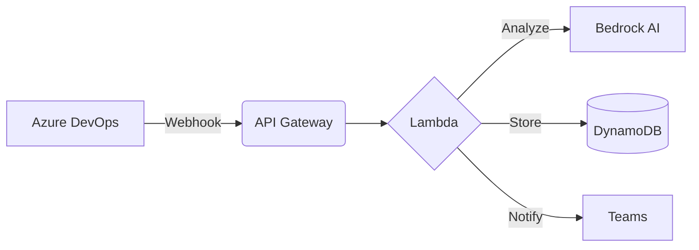

# 🚀 Deployment Guide

Complete guide to deploy this portfolio and projects to GitHub

## 📋 Prerequisites

- Git installed
- GitHub account
- GitHub CLI (optional, recommended)

## 🎯 Quick Start

### Option 1: Using GitHub CLI (Recommended)

```bash
# 1. Navigate to portfolio directory
cd C:\Users\arthi.raj\AMD\poc-chatbot\portfolio\github-repo

# 2. Initialize git repository
git init

# 3. Add all files
git add .

# 4. Create initial commit
git commit -m "Initial commit: Cloud Architecture Portfolio"

# 5. Create GitHub repository and push
gh repo create arthiraj-cloud-portfolio --public --source=. --push
```

### Option 2: Manual GitHub Setup

```bash
# 1. Navigate to portfolio directory
cd C:\Users\arthi.raj\AMD\poc-chatbot\portfolio\github-repo

# 2. Initialize git repository
git init

# 3. Add all files
git add .

# 4. Create initial commit
git commit -m "Initial commit: Cloud Architecture Portfolio"

# 5. Create repository on GitHub.com manually
# Go to: https://github.com/new
# Repository name: arthiraj-cloud-portfolio
# Description: Cloud Architecture Portfolio - 10 Years Experience
# Public repository
# Don't initialize with README (we already have one)

# 6. Add remote and push
git remote add origin https://github.com/YOUR_USERNAME/arthiraj-cloud-portfolio.git
git branch -M main
git push -u origin main
```

## 📂 Repository Structure

```
arthiraj-cloud-portfolio/
├── README.md                          # Main documentation
├── DEPLOY.md                          # This file
├── LICENSE                            # License file
├── .gitignore                         # Git ignore rules
│
├── architectures/                     # Architecture documentation
│   ├── self-healing-cicd/
│   │   ├── README.md
│   │   └── architecture.png
│   ├── bedrock-teams-bot/
│   ├── resource-provisioning/
│   └── s3-reclaim/
│
├── projects/                          # Project details
│   ├── self-healing-pipeline/
│   ├── bedrock-teams-integration/
│   ├── s3-storage-reclaim/
│   └── bus-finder-app/
│
├── diagrams/                          # Visual diagrams
│   ├── flow-diagrams/
│   ├── infrastructure/
│   └── integrations/
│
├── code-samples/                      # Code examples
│   ├── lambda-functions/
│   ├── terraform-modules/
│   └── automation-scripts/
│
└── presentations/                     # Presentations
    └── self-healing-workflow.html
```

## 🔐 Security Best Practices

### What to NEVER commit:

❌ API keys, tokens, passwords
❌ AWS credentials
❌ Azure PAT tokens
❌ Private SSH keys
❌ Database credentials
❌ Webhook URLs (sensitive ones)

### Before pushing:

```bash
# 1. Review what you're committing
git status
git diff

# 2. Check for secrets
git secrets --scan

# 3. Use .gitignore (already included)
```

### .gitignore includes:

```gitignore
# Secrets
*.pem
*.key
.env
secrets.json
credentials.json

# AWS
.aws/
terraform.tfstate
terraform.tfstate.backup

# Azure
.azure/

# IDE
.vscode/
.idea/

# OS
.DS_Store
Thumbs.db
```

## 📝 Commit Message Guidelines

Use conventional commit format:

```bash
# Features
git commit -m "feat: add self-healing CI/CD architecture"

# Documentation
git commit -m "docs: update deployment guide"

# Bug fixes
git commit -m "fix: correct terraform module path"

# Architecture changes
git commit -m "arch: redesign bedrock integration flow"
```

## 🌟 GitHub Repository Settings

### 1. Repository Settings

**General:**
- ✅ Enable Issues
- ✅ Enable Projects
- ✅ Enable Wiki
- ✅ Restrict editing to collaborators only

**Features:**
- ✅ Wikis (for additional docs)
- ✅ Discussions (for Q&A)
- ❌ Sponsorships (optional)

### 2. Add Topics/Tags

Add these topics to your repository for discoverability:

```
aws, azure, gcp, cloud-architecture, devops, terraform, 
lambda, bedrock, ai, automation, ci-cd, infrastructure, 
react-native, mobile-development, serverless
```

### 3. Create GitHub Pages (Optional)

Host your portfolio HTML directly from GitHub:

```bash
# 1. Create gh-pages branch
git checkout -b gh-pages

# 2. Copy portfolio HTML
cp ../enhanced-portfolio.html index.html

# 3. Commit and push
git add index.html
git commit -m "docs: add portfolio website"
git push origin gh-pages

# 4. Enable GitHub Pages in repo settings
# Settings > Pages > Source: gh-pages branch
```

Your portfolio will be available at:
`https://YOUR_USERNAME.github.io/arthiraj-cloud-portfolio/`

### 4. Add Repository Badges

Add these to your README.md:

```markdown


```

## 📊 Adding Diagrams

### Using Draw.io/Diagrams.net

```bash
# 1. Create diagrams at diagrams.net
# 2. Export as PNG and SVG
# 3. Save to diagrams/ folder

git add diagrams/flow-diagrams/self-healing-flow.png
git commit -m "docs: add self-healing architecture diagram"
git push
```

### Using Mermaid (in Markdown)

````markdown

````

## 🔄 Keeping Repository Updated

```bash
# Regular updates
cd C:\Users\arthi.raj\AMD\poc-chatbot\portfolio\github-repo

# Pull latest changes
git pull

# Make changes to documentation/code

# Stage changes
git add .

# Commit with meaningful message
git commit -m "docs: update bedrock integration details"

# Push to GitHub
git push
```

## 📢 Promoting Your Portfolio

### 1. Update LinkedIn

```
I'm excited to share my cloud architecture portfolio! 

10 years of designing enterprise-scale solutions across AWS, Azure, and GCP.

Check out my latest projects:
🤖 Self-Healing CI/CD with AI
💬 Bedrock Teams Integration
🔧 Automated Infrastructure Provisioning
📱 Mobile Apps with Google Maps

GitHub: https://github.com/YOUR_USERNAME/arthiraj-cloud-portfolio

#CloudArchitecture #AWS #Azure #DevOps #AI #Automation
```

### 2. Share on Twitter/X

```
Excited to open-source my cloud architecture portfolio! 

10 years of building enterprise solutions with AWS, Azure & GCP 🚀

Featured projects:
✨ AI-powered self-healing CI/CD
✨ Bedrock Teams bot
✨ Infrastructure automation
✨ Mobile apps

Check it out: [GitHub Link]

#CloudComputing #DevOps #AWS
```

### 3. Add to Resume

```
GitHub Portfolio: https://github.com/YOUR_USERNAME/arthiraj-cloud-portfolio
Portfolio Website: https://YOUR_USERNAME.github.io/arthiraj-cloud-portfolio/
```

## 🛡️ License

Add a LICENSE file:

```bash
# For open-source (MIT License)
curl https://raw.githubusercontent.com/licenses/license-templates/master/templates/mit.txt > LICENSE

# Replace [year] with 2026
# Replace [fullname] with "Arthi Raj"
```

For proprietary/closed-source:

```
Copyright (c) 2026 Arthi Raj

All rights reserved. This repository contains proprietary 
architectures and designs. Contact me for permission before 
using any content.
```

## 📧 Repository README Template

Make sure your main README.md includes:

- ✅ About section with your experience
- ✅ Project showcase with links
- ✅ Technical skills
- ✅ Architecture diagrams
- ✅ Contact information
- ✅ License information
- ✅ Badges and stats

## 🎯 Next Steps After Deployment

1. **Star your own repository** (shows engagement)
2. **Watch for activity** (enable notifications)
3. **Create GitHub Projects** (organize your work)
4. **Enable Discussions** (for Q&A)
5. **Add CONTRIBUTING.md** (if open to contributions)
6. **Create Issues** (for future enhancements)
7. **Pin Important Repositories** (on your profile)

## 📱 GitHub Mobile App

Download GitHub mobile app to:
- Monitor repository activity
- Respond to issues/discussions
- Review pull requests
- Update documentation on the go

## 🔍 SEO Optimization

### Repository Description

```
Cloud Architecture Portfolio by Arthi Raj - 10 Years Experience | 
AWS, Azure, GCP | AI-Powered Automation | Terraform | DevOps | 
CI/CD | Serverless | Mobile Development
```

### README Keywords

Include keywords naturally:
- Cloud Architecture
- AWS Lambda, Bedrock, DynamoDB
- Azure DevOps, Pipelines
- Terraform, Infrastructure as Code
- AI/ML, Automation
- DevOps, CI/CD
- React Native, Mobile Apps

## 📞 Support

If you encounter issues during deployment:

1. Check GitHub Status: https://www.githubstatus.com/
2. Review GitHub Docs: https://docs.github.com/
3. Contact: arthi.raj1997@gmail.com

## ✅ Deployment Checklist

Before going public, ensure:

- [ ] No secrets committed
- [ ] .gitignore configured
- [ ] README.md complete
- [ ] Architecture diagrams added
- [ ] Code samples sanitized
- [ ] Contact info updated
- [ ] License file added
- [ ] Repository description set
- [ ] Topics/tags added
- [ ] GitHub Pages enabled (optional)

---

**Ready to deploy!** 🚀

Run the quick start commands and your portfolio will be live on GitHub!
